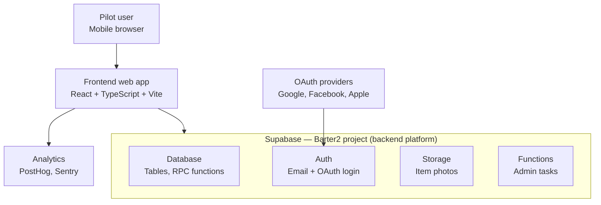
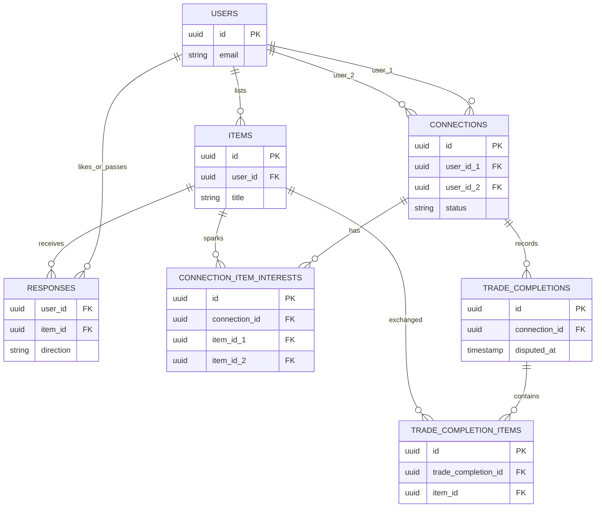

# Barter — System Architecture Reference

**Purpose:** a visual reference for how Barter's pieces fit together, at two levels of detail — the overall system (Container view) and the connection-model database schema (ERD). Companion to `Barter_PRD.md` and `Barter_Project_Plan.md`, which remain the source of truth for product and execution decisions. This document is a snapshot for orientation, not a tracked decision log — update it if the architecture changes meaningfully, but don't treat it as something to keep in lockstep with every small edit.

**Generated:** July 2026, based on the state of the `phase1-rewrite` branch at the time (connection-model migration drafted and committed, not yet run against Barter2).

---

## 1. Container view

The system end to end: who uses it, what runs where, and what it talks to.

**Notes:**
- Everything inside the Supabase box is one deployable project (Barter2), not four independently deployed services — they're functionally distinct but operationally scale together.
- The RPC functions (`check_and_create_match`, `record_response_optimized`, and the planned shared user-id-sorting helper) live inside the **Database** box — they're Postgres functions, not a separate application-server tier.
- **Open gap, not resolved here:** the actual mechanism for sending emails (verification, password reset, notification emails) isn't documented anywhere in the PRD or Project Plan yet. Supabase has some built-in email capability, but whether that's what's actually used, or whether a separate provider is planned, needs to be confirmed before Claude Code builds anything email-dependent.

---

## 2. Connection-model schema (ERD)

The core tables from the connection-model migration (`supabase/migrations/20260725000000_connection_model.sql`) and how they relate.

**Notes:**
- This is simplified for readability. The real migration file also enforces `user_id_1 < user_id_2` as a database-level check constraint on `connections` (not shown here), plus additional indexes and security fixes added during the migration's security review.
- The migration file itself, not this diagram, is the source of truth for exact columns and constraints — treat this ERD as an orientation aid, not a schema reference for implementation.

---

## How to use this document

Read this alongside `Barter_PRD.md` (product intent) and `Barter_Project_Plan.md` (execution tracker) when you need a quick visual refresher on how the system fits together, especially before starting a new Claude Code session touching the backend. If the architecture changes in a way that makes this page misleading (new services, major schema changes), regenerate or edit it — but routine schema tweaks don't need this file updated every time.